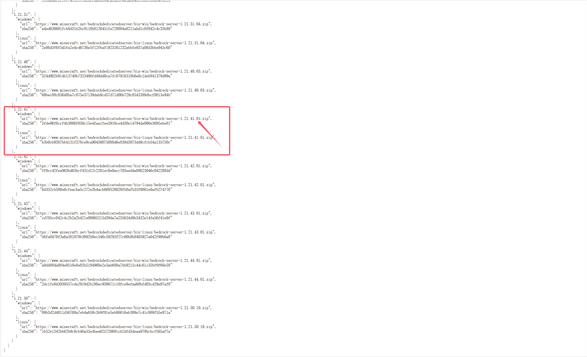
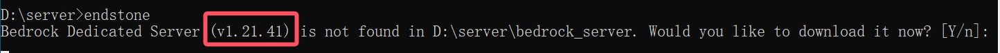

## 前提要求

你需要在电脑上准备：

Windows 环境下：

-   [VS Code](https://code.visualstudio.com/) 编辑器
-   可选：最新版 [Python 3.12+ 环境](https://python.org)

Linux 环境下：

-   最新版 [Python 3.12+ 环境](https://python.org) 或者 最新版 [Docker 环境](https://hub.docker.com/r/endstone/endstone/)

## 方法一：直接下载启动

当前教程使用操作环境：Windows Server 2022

适用环境：Windows

### 一、下载 EndStone 本体

前往 EndStone 开源仓库：[GitHub](https://github.com/EndstoneMC/endstone)，找到 Releases，打开后下载压缩包


将下载好的压缩包放到新建的文件夹内，或者上传到服务器上的新建好的文件夹内


解压后获得 EndStone 本体


### 二、下载 BDS 服务端

启动 start.bat，获得该版本的 EndStone 支持的 BDS 服务端版本


目前已知该版本的 EndStone 支持对接 1.21.41 版本

关闭界面，前往 [EndStone API](https://raw.githubusercontent.com/EndstoneMC/bedrock-server-data/main/bedrock_server_data.json) 找到相应版本的下载地址

复制相应的 URL 后的下载链接，直接粘贴到新窗口的 web 地址栏回车下载 BDS 服务端压缩包



将下载后的服务端 zip 压缩包放入 EndStone 文件夹内

### 三、准备服务端

创建 bedrock_server 文件夹


将 BDS 服务端 zip 压缩包解压到 bedrock_server 文件夹

然后，创建 `version.txt` 文件，打开并编辑以下内容，编辑完毕后保存


### 四、启动服务器

回到 EndStone 文件夹，启动 start.bat

启动成功后会显示下面内容


恭喜你！你已经成功开启了可以支持插件的基岩版服务器！赶紧体验一下吧~

## 方法二：使用 Python pip 运行

当前教程使用操作环境：Windows Server 2022

适用环境：Windows、Linux

### 一、安装 Python 环境

前往 [Python 官网](https://python.org) 下载 Python 环境

:::note

Linux 请按照 [这个教程](https://blog.csdn.net/hd243608836/article/details/121417965) 或者必应搜索 **Python Linux 安装** 完成安装 python 最新版，_安装完毕请看第二步_

:::

运行 Python 安装包程序进行安装：


安装完成后，打开 CMD（按住 `WIN + R` 打开后输入 `cmd` 回车），输入以下指令检测 Python 是否正常安装

```bash
python
```

安装好 CMD 会这么显示：


### 二、安装 EndStone 本体

重新打开 CMD，使用以下指令转到你已经创建好的新文件夹

如果在 C 盘，请输入 `cd 替换具体文件夹路径`

:::danger

**不建议将服务端放在 C 盘！**

:::

如果在 D 盘，请按照下图操作进行（**Linux 一类系统可直接使用 `cd 文件夹路径` 进入相应目录**）


输入下面指令安装 EndStone 本体 (Python 默认的下载会比较慢，如果想加快下载速度推荐必应搜索 **Python 换国内下载源** 配置，本教程不再过多阐述)

```bash
pip install endstone
```

下载完后应该是这样的


### 三、安装 VC 运行库

前往 [Microsoft VC 运行库下载地址](https://www.microsoft.com/zh-CN/download/details.aspx?id=48145) 下载并安装 **VC 运行库**

:::tip

你可能注意到了，直接运行版本是可以直接运行的，貌似这一步被省略过去了

实际上并不是，只是直接运行版本自带了 Python 环境和 VC 运行库，一般情况下运行 EndStone 的 start.bat 是不会出现任何问题（**除非你作死把那个删了，但会有人去删掉它吗 🤔**）

:::

### 四、下载 BDS 服务端

CMD 控制台输入 `endstone` ，获得该版本的 EndStone 支持的 BDS 服务端版本



通过上图可知，目前该版本的 EndStone 支持对接 1.21.41 版本

关闭界面，前往 [EndStone API](https://raw.githubusercontent.com/EndstoneMC/bedrock-server-data/main/bedrock_server_data.json)

找到相应版本的下载地址，复制 URL 后的下载链接，直接粘贴到新窗口的 web 地址栏回车下载 BDS 服务端压缩包


将下载后的服务端 zip 压缩包放入 EndStone 文件夹内

### 五、准备服务端

创建 bedrock_server 文件夹


将 BDS 服务端 zip 压缩包解压到 bedrock_server 文件夹

然后，创建 `version.txt` 文件，打开并编辑以下内容，编辑完毕后保存


### 六、启动服务器

回到 CMD，输入 `endstone` 开始运行服务器。

启动成功后会显示下面内容


恭喜你！你已经成功开启了可以支持插件的基岩版服务器！赶紧体验一下吧~

## 方法三、使用 Docker 安装并运行 EndStone（目前不推荐）

:::danger

该方案教程大部分操作情况未知，外加 Docker 官方源因 DNS 污染等攻击 被国内防火墙拦截，目前不推荐

请等待教程作者的更新

:::

适用系统：Linux

### 一、安装 Docker

### 二、更改国内源

### 三、拉取镜像源

### 四、运行服务器
