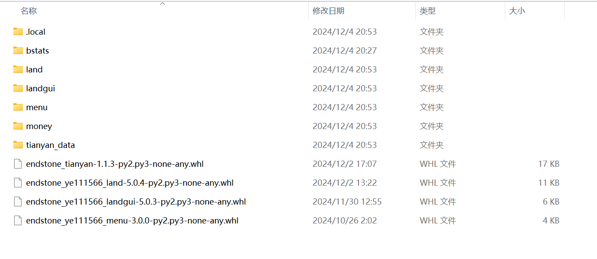

## 第一步、EndStone 插件来源

目前插件来源：

### [MineBBS 论坛](https://www.minebbs.com/resources/categories/bdserver.38/)（发展国内基岩版社区的你敢说没有？）


### [pip 源](https://pypi.org/search/?q=endstone) （EndStone 绝大多数插件都在这里发布了）


### [Bedrinth 下载站](https://bedrinth.com/?platform=endstone) （除了 pip 外另一个比较知名的下载源，网速较慢，不太推荐）


## 第二步、如何安装？

### 单文件安装

如果你在 MineBBS 上下载，或者其他人给你的一个 EndStone 插件，请看这里

:::tip

EndStone 的插件一般文件是以 `.whl` 或者 `.dll` 为后缀的文件，有的插件作者为了易于分发或者安装插件会将上述内容和配置文件一起弄成压缩文件

:::

:::note

附带：什么是 whl 文件：

whl 格式本质上是一个压缩包，里面包含了 py 文件，以及经过编译的 pyd 文件。

可以在不具备编译环境的情况下，选择合适自己的 Python 环境进行安装。

说白了，whl 就是 Python 的压缩包。

常玩 Java 版的话，你可以理解为它是 **Python 版 的 .jar 文件**，只是运行环境由 _Java_ 改为 _Python_（可以这么想吧）

:::



#### 第一步、下载插件

在 MineBBS 以及其他论坛或者 QQ 群等渠道下载的文件，你可能会获得

-   whl 文件
-   或者 zip 一类 压缩包

压缩包请使用常用压缩软件打开备用

:::tip

打开压缩包推荐使用 BandiZIP、360 压缩、7z 或者 WinRAR 等专业压缩文件

:::

#### 第二步、安装插件

关闭服务器（**别告诉我你不会，小心我【语言激动，已省略】**）

##### 如果是 whl 文件

1、打开 `bedrock_server` 文件夹，你会惊奇的发现：什么时候多了个 `plugins` 文件夹？！！


2、打开 `plugins` 文件夹，将下载的 whl 插件文件拽入该文件夹中

3、启动！当 CMD 显示插件名称时说明插件已加载成功！


4、如果你真不知道如何辨别插件是否加载，请在后台输入 `plugins` 指令


##### 如果是压缩包文件

比如下面这个赖皮家伙（不是）


教你三招：

1、按下 `Ctrl + A` 全选，复制压缩包内的所有文件

2、打开 `bedrock_server\plugins` 后，粘贴

3、启动！享受插件便利！


##### 插件配置

有的会在下载的压缩文件中提前准备好


有的会在启动一次服务器后自动生成


编辑他们很简单，打开相应插件的文件夹，然后使用 VS Code 或者 Nodepad-- 一类编辑器对插件进行配置

:::danger

请注意插件配置的文件格式，并按照他们的规则去写！，如果插件有 Wiki 一类请先看他们的 Wiki 再编辑！

:::

### pip 安装

在上面给的 pip 渠道 上找到心仪的插件后，使用下面指令完成下载：

```bash
pip install 插件名
```


然后重启服务器，插件会自动安装完毕啦~
